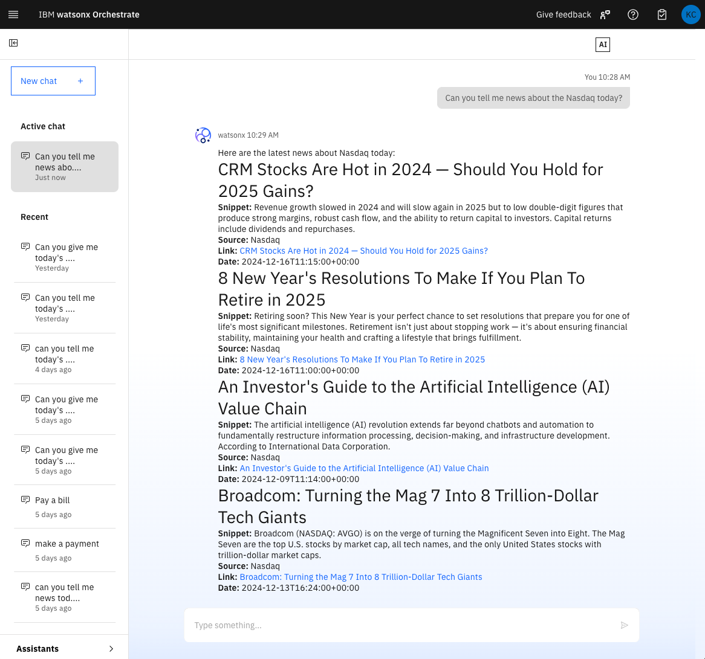

# IBM Watsonx Orchestrate - External Agent Example

Use these examples to kick-start your external agent development.

For official feature documentation, refer to the [IBM Developer API Catalog](https://developer.ibm.com/apis/catalog/watsonorchestrate--custom-assistants/api/API--watsonorchestrate--ibm-watsonx-orchestrate-api#Register_an_external_chat_completions_agent__agents_external_chat_post).

## Overview

This example demonstrates how to deploy an external agent as a serverless application in IBM Cloud. The application leverages 
FastAPI and [LangGraph](https://www.langchain.com/langgraph) to create a chat completion service that integrates with IBM watsonx and OpenAI models. It also includes AI tools for web and news searches using DuckDuckGo.

## Features

- **Chat Completion Service**: The application provides a RESTful API endpoint for chat completions, supporting both synchronous and streaming responses following the specification of IBM Orchestrate external agents.
- **Integration with AI Models**: It provides an example that supports multiple AI models, including IBM's watsonx and OpenAI's GPT, allowing for flexible AI-driven interactions.
- **Tool Integration**: The application includes tools for web and news searches using DuckDuckGo, which can be invoked during chat interactions.
- **Token Management**: Implements a caching mechanism for IBM Cloud IAM tokens to optimize authentication processes.
- **Logging and Debugging**: Logging is set up to facilitate debugging and monitoring of the application.

## Security Limitations

Please be aware that this example accepts any API Key or Bearer token for authentication. 
It is recommended to implement your own authentication security measures to ensure proper security.

## Deployment Instructions

### Step 1: Create a Code Engine Project

1. **Using IBM Cloud Web UI:**
   - Navigate to [IBM Cloud Code Engine Projects](https://cloud.ibm.com/containers/serverless/projects) and select **Create**. Name your project, for instance `wxo-agent-test1`.
   - Select the agent you created (`wxo-agent-test1`) and choose the **Application** menu item from the left navigation panel.

2. **Create an API Key for Registry Secret:**
   - Select **Manage** from the title bar menu and go to **Access (IAM)**.
   - From the left navigation menu, select **API keys**.
   - Click **Create** and copy the new API key for use in the registry secret.

3. **Create the Code Engine Application:**
   - Click the **Create** button to start creating an application.
   - Under **Code**, select **Build container image from source code**.
   - In the **Code repo URL** field, enter `https://github.com/watson-developer-cloud/watsonx-orchestrate-developer-toolkit`.
   - Click **Specify build details**:
     - **SSH secret:** None
     - **Branch name:** main
     - **Context directory:** `external_agent/examples/langgraph_python`
     - Click **Next**
     - **Dockerfile:** Dockerfile (leave default)
     - Click **Next**
     - Under **Registry secret**, create a secret (if one doesn't exist) using the **API Key** created above
   - **Application name:** Any name, for instance `wxo-agent-test1-app1`
   - **Domain mappings:** Public

4. **Set Environment Variables:**
   - Add the following environment variables:
     - `WATSONX_SPACE_ID`
     - `WATSONX_API_KEY`
     - `OPENAI_API_KEY` (only needed if you plan to use OpenAI models)
   - Select the `Create` button

5. **Test the Application:**
   - Choose **Test application** and click **Application URL**.
     - It is expected this page will not be found, we need to slightly update the path
   - Append `/docs` to the end of the URL path to view a formatted API page.
     - Example: `https://wxo-agent-test1-app1.1pj4w3r1pi47.us-south.codeengine.appdomain.cloud/docs`

### Step 2: Register the New Endpoint as an External Agent

1. **In IBM watsonx orchestrate Web UI:**
   - From the top left hamburger menu, select **Agent Configuration**.
   - Select **Assistants** from the left-hand navigation.
   - Click the **Add assistant** button on the top right.
   - Choose **External Assistant** at the top of the dialog.
   - Check the **External-agent Assistant** box.

2. **Enter Details:**
   - **Display Name:** e.g., News Today
   - **Description:** Enter a description of capabilities, for instance `Agent to retieve current news`
   - **API Key:** Enter your API key.
   - **Service Instance URL:** Use the Test URL with `/chat/completions` appended.
     - Example: `https://wxo-agent-test1-app1.1pj4w3r1pi47.us-south.codeengine.appdomain.cloud/chat/completions`

### Step 3: Call the new External Agent from Orchestrate

1. **In IBM watsonx orchestrate Web UI:**
   - From the top left hamburger menu, select **Agent Configuration**.
   - Select **Chat** from the left-hand navigation.
   - Type a question that should route to the new agent, like `Can you tell me news about the Nasdaq today?`
   - The results from the external agent should be streamed to the IBM watsonx Orchestrate chat window

